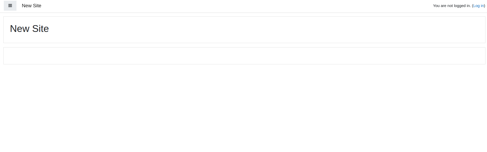
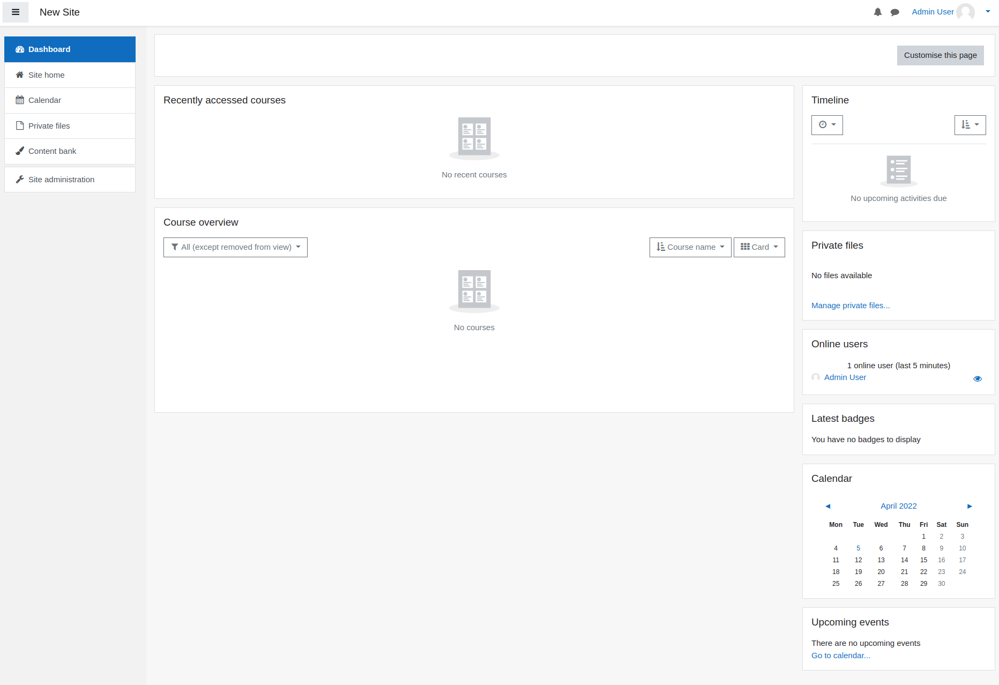

## Moodle Installation Instructions 

### Start Moodle

Be patient this can take a while.

### Log in with the username admin and the password you specified in the installation. 
The default admin user name is `user` and password is `bitnami`. During the installation within **BIBBOX** these values are set. 

### Use Moodle

## After the installation
Have a nice ride with the Admins youngtimer.

